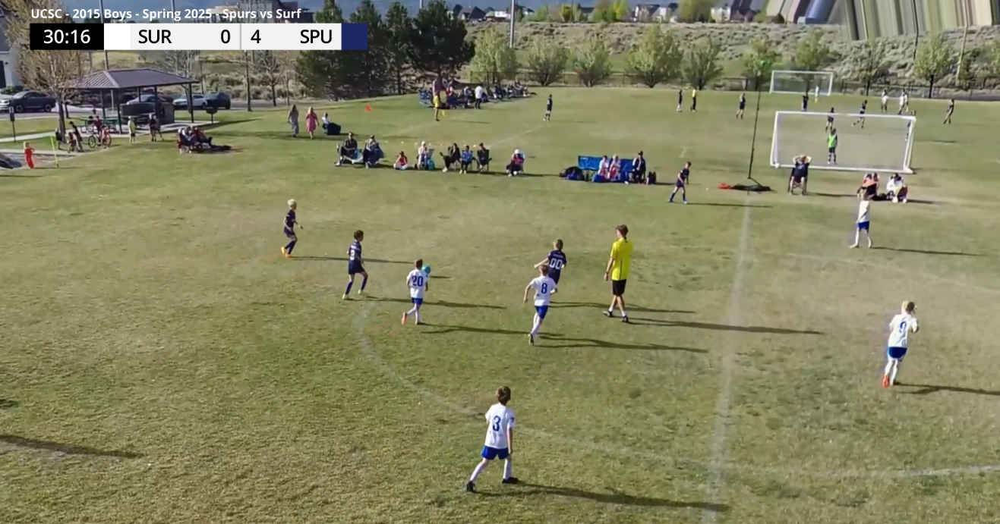
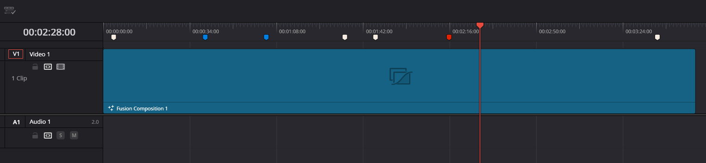

# DaVinci Resolve MLS Scorebug Scripts

A collection of Lua scripts for automating sports score displays and highlight creation in DaVinci Resolve.

## Overview

This toolset helps video editors automate the scoring workflow for sports videos in DaVinci Resolve. The scripts work together to:
- Place and update team scores on a scorebug overlay
- Create highlight regions around scoring events
- Manage timeline markers for clean organization

## Scripts Included

- **All Score Processing**: Main script that runs the complete workflow in sequence
- **Set Scorebug**: Updates scores on the scorebug based on colored markers
- **Score Highlights**: Converts markers into highlight regions
- **Whiteout Markers**: Creates a clean timeline by converting colored markers to white
- **Restore Marker Colors**: Reverts whiteout markers back to their original colors

## Requirements

- DaVinci Resolve 18 or newer
- Windows, macOS, or Linux

## Installation

Run the included PowerShell script `install_scripts.ps1` to automatically install:
- All Lua scripts to `%APPDATA%\Blackmagic Design\DaVinci Resolve\Support\Fusion\Scripts\Comp`
- MLS-Scoreboard setting to `%APPDATA%\Blackmagic Design\DaVinci Resolve\Support\Fusion\Macros`

## Usage

1. In Davinci Resolve
    - Create Project
    - Create Timeline
    - Create new Fusion Composition named "Fusion Composition 1"
    - Add "MLS Scorebug" to fusion composition and route output to MediaOut
    - Update Team Names/Colors and League Title
2. Place colored markers on your timeline:
   - Cream markers: Time indicators (first half, halftime, second half, full time)
   - Blue markers: Team on the *LEFT* of scoreboard scores
   - Red markers: Team on the *RIGHT* of scoreboard scores

3. Run `All Score Processing.lua` from the Fusion Scripts menu
4. The script will update your scorebug, create highlight regions, and clean up the timeline

## License

Released under the MIT License. See the LICENSE file for details.

## Author

Created by Tyler Nichols - May 2025